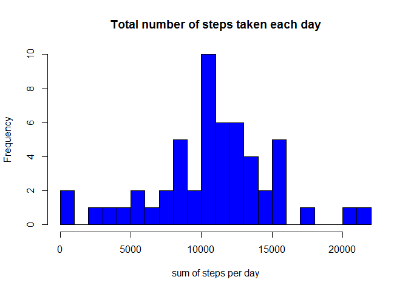
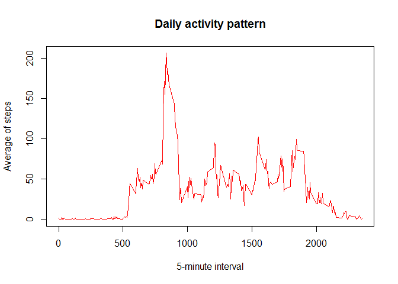
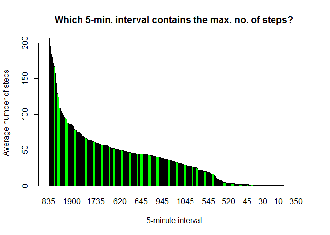
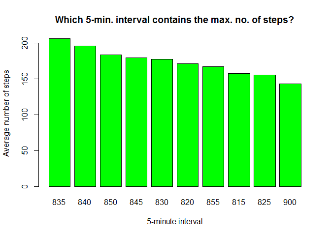
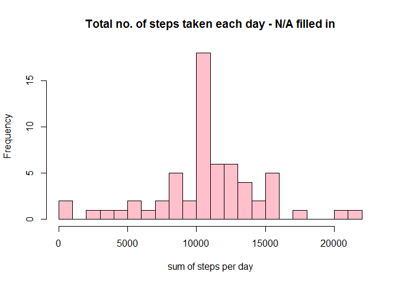
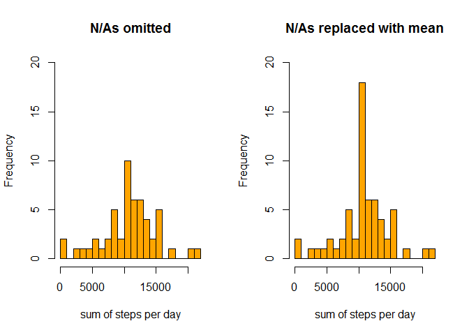
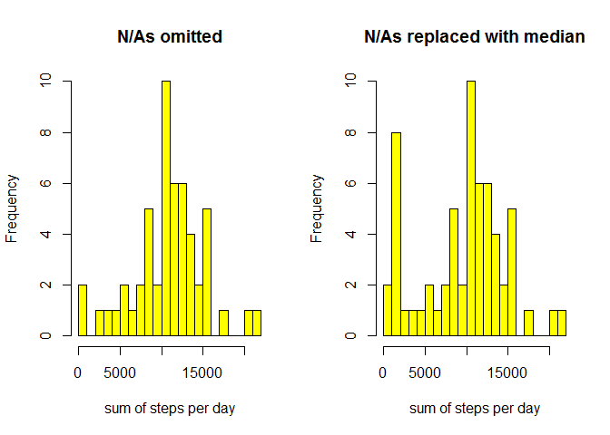
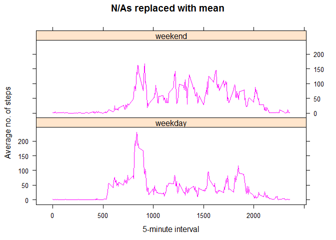
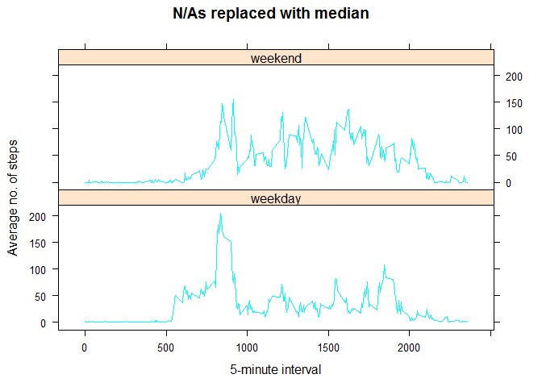

# Reproducible Research: Peer Assessment 1
  
  
### --- RUNNING ENVIRONMENT --- 

Windows 7 (64-bit), R version 3.1.3, RStudio version 0.98.1103  
  
PLEASE NOTE:    
- toc: changed to "no" as I do not want automatically generated table of contents.  
- I do not round up the figures in the calculations.  
- Enlgish is not my first language, so my appologies for any bad English.


## ECHO - Setting Global Options
"When writing code chunks in the R markdown document, always use echo = TRUE so that someone else will be able to read the code."  
So every code chuck is set as `{r, echo = TRUE}`


## Loading and preprocessing the data


### Working directory
We will be working from a directory called "data" in our workign directory.  
So first we check if a directory "data" exists and if directory does not exist, then we create a directory "data" in our working directory


```r
if (!file.exists("data")) { 
    dir.create("data")    }
```


### Downloading data
We can download the data by clicking [link to assignment file](https://d396qusza40orc.cloudfront.net/repdata%2Fdata%2Factivity.zip) and save it in "data" directory
  
or  
  
we can run the code below  
`fileUrl <- "https://d396qusza40orc.cloudfront.net/repdata%2Fdata%2Factivity.zip"`
`download.file(fileUrl, destfile = "./data/download.zip")`  
no "curl" as we are running this script on Windows 7.  

Than we can use the code below to unzip the data:  
`unzip("./data/activity.zip", exdir = "./data")`


### Reading data
we use `read.csv()` to read into dataset "A1" from "data" specifying the header as valid

```r
A1 <- read.csv("./data/activity.csv", header = TRUE)
```


### Data
The dataset included in the assignment contains variables:

steps | date | interval
------------ | ------------- | -------------
Number of steps taking in a 5-minute interval (missing values are coded as NA) | The date on which the measurement was taken in YYYY-MM-DD format | Identifier for the 5-minute interval in which measurement was taken

To display the structure of our loaded data "A1" we run:

```r
str(A1)
```

```
## 'data.frame':	17568 obs. of  3 variables:
##  $ steps   : int  NA NA NA NA NA NA NA NA NA NA ...
##  $ date    : Factor w/ 61 levels "2012-10-01","2012-10-02",..: 1 1 1 1 1 1 1 1 1 1 ...
##  $ interval: int  0 5 10 15 20 25 30 35 40 45 ...
```


## (PART ONE) 

## What is mean total number of steps taken per day?


### Data cleaning
"For this part of the assignment, you can ignore the missing values in the dataset."  
  

### 1. Calculate the total number of steps taken per day

Using  dplyr package

```r
library(dplyr)
```

we need to create a new dataset "A2" with sum of steps per day (ignoring N/A values i.e. not addressing them at all here)

```r
A2 <- summarise(group_by(A1, date), StepsPerDay = sum(steps))
```

The result is a table

```r
head(A2)
```

```
## Source: local data frame [6 x 2]
## 
##         date StepsPerDay
## 1 2012-10-01          NA
## 2 2012-10-02         126
## 3 2012-10-03       11352
## 4 2012-10-04       12116
## 5 2012-10-05       13294
## 6 2012-10-06       15420
```


### 2.(1) "If you do not understand the difference between a histogram and a barplot, research the difference between them."
There are two differences:  
1. one is in the type of data that is presented  
2. and the other in the way they are drawn.  
[read more](http://mathcentral.uregina.ca/QQ/database/QQ.09.99/raeluck1.html)  
  
The main difference is:  
- With bar charts, each column represents a group defined by a categorical variable  
- and with histograms, each column represents a group defined by a quantitative variable.  

So:  
- With bar charts the labels on the X axis are categorical  
- and with histograms, they are quantitative.  
[read more](http://stattrek.com/statistics/charts/histogram.aspx?Tutorial=AP)


### 2.(2) Make a histogram of the total number of steps taken each day

Using `hist()` we plot the total number of steps taken each day (from our dataset "A2")

```r
hist(A2$StepsPerDay, 
     breaks = 30,
     main = "Total number of steps taken each day",
     xlab = "sum of steps per day",
     col = "blue")
```

 

### 3. Calculate and report the mean and median of the total number of steps taken per day
Here we cannot ignore N/A values (as the result would be N/A), so need to omit them when calculating mean and median using `na.rm` 
  
  
The mean of total steps per day is:

```r
mean(A2$StepsPerDay, na.rm = TRUE)
```

```
## [1] 10766.19
```

The median of total steps per day is:  

```r
median(A2$StepsPerDay, na.rm = TRUE)
```

```
## [1] 10765
```


## (PART TWO) 

## What is the average daily activity pattern?
  
  
#### 1. Make a time series plot (i.e. type = "l") of the 5-minute interval (x-axis) and the average number of steps taken, averaged across all days (y-axis).

We need to create a new dataset "A3" with an average of steps per 5-minute interval


```r
A3 <- summarise(group_by(A1, interval), AvgSteps = mean(steps, na.rm = TRUE))
```

and do a line plot  ```type = "l"```


```r
plot(A3$interval, A3$AvgSteps, 
     main = "Daily activity pattern",
     xlab = "5-minute interval",
     ylab = "Average of steps",  
     type = "l", 
     col = "red")
```

 


#### 2. Which 5-minute interval, on average across all the days in the dataset, contains the maximum number of steps?


We need to sort descending the average of steps per 5-minute interval (from our previous calculation in dataset "A3") in new dataset "A4".

```r
A4 <- arrange(A3, desc(AvgSteps))
```

and the answer is in the first row of dataset "A4"

```r
head(A4, n = 1)
```

```
## Source: local data frame [1 x 2]
## 
##   interval AvgSteps
## 1      835 206.1698
```

or if we want to show the answer on a plot

```r
barplot(A4$AvgSteps, 
        main = "Which 5-min. interval contains the max. no. of steps?",
        xlab = "5-minute interval",
        ylab = "Average number of steps",
        names.arg = A4$interval,
        col = "green")
```

 

or we can reduce the number of results from "A4" dataset for readability, so we create new dataset "A5" with only 10 rows from dataset "A4")

```r
A5 <- head(A4, n = 10)
barplot(A5$AvgSteps, 
        main = "Which 5-min. interval contains the max. no. of steps?",
        xlab = "5-minute interval",
        ylab = "Average number of steps",
        names.arg = A5$interval,
        col = "green")
```

 
  
  

## (PART THREE)

## Imputing missing values

"Note that there are a number of days/intervals where there are missing values (coded as `NA`). The presence of missing days may introduce bias into some calculations or summaries of the data."


#### 1. Calculate and report the total number of missing values in the dataset (i.e. the total number of rows with NAs)

We can count NAs from our dataset "A1", so the total number of missing values in the dataset is:

```r
sum(length(which(is.na(A1$steps))))
```

```
## [1] 2304
```

Just to make sure that we did not misunderstand "days/intervals" we check if there are any N/As in "date" and "interval"

```r
sum(length(which(is.na(A1$date))))
```

```
## [1] 0
```

```r
sum(length(which(is.na(A1$interval))))
```

```
## [1] 0
```


#### 2. Devise a strategy for filling in all of the missing values in the dataset. The strategy does not need to be sophisticated. For example, you could use the mean/median for that day, or the mean for that 5-minute interval, etc.

We will fill N/A with an average for each 5-minute interval (we will create an index for each interval).

First we create a new dataset "A6" for "steps" from original dataset "A1"


```r
A6 <- data.frame(A1$steps)
```
then we populate our "A6" dataset with the average for each 5-minute interval, using `tapply` and `mean` function


```r
A6[is.na(A6),] <- tapply(X=A1$steps, INDEX=A1$interval, FUN=mean, na.rm = TRUE)
```


#### 3. Create a new dataset that is equal to the original dataset but with the missing data filled in.

so we are creating new dataset "A7" where we are combining "steps" with N/A values filled in with an average across all days by "interval", with the original dataset "A1" for columns "date" and "interval"


```r
A7 <- cbind(A6, A1[,2:3])
colnames(A7) <- c("steps", "date", "interval")
```
We can see the original dataset which has missing values


```r
head(A1)
```

```
##   steps       date interval
## 1    NA 2012-10-01        0
## 2    NA 2012-10-01        5
## 3    NA 2012-10-01       10
## 4    NA 2012-10-01       15
## 5    NA 2012-10-01       20
## 6    NA 2012-10-01       25
```
and our new dataset "A7" which has N/A values filled in

```r
head(A7)
```

```
##       steps       date interval
## 1 1.7169811 2012-10-01        0
## 2 0.3396226 2012-10-01        5
## 3 0.1320755 2012-10-01       10
## 4 0.1509434 2012-10-01       15
## 5 0.0754717 2012-10-01       20
## 6 2.0943396 2012-10-01       25
```


#### 4.(1) Make a histogram of the total number of steps taken each day 

We need to create a new dataset "A8" (from dataset "A7") with a sum of steps per day


```r
A8 <- summarise(group_by(A7, date), StepsPerDay = sum(steps))
```

Using `hist()` we can plot our total number of steps taken each day (with our N/A values filled in as per pt.3)


```r
hist(A8$StepsPerDay, 
     breaks = 30,
     main = "Total no. of steps taken each day - N/A filled in",
     xlab = "sum of steps per day",
     col = "pink")
```

 

#### 4.(2) and Calculate and report the mean and median total number of steps taken per day.

The mean of total steps per day with N/As filled in is:

```r
mean(A8$StepsPerDay)
```

```
## [1] 10766.19
```

The median of total steps per day with N/A filled in is:  

```r
median(A8$StepsPerDay)
```

```
## [1] 10766.19
```
  
  
#### 4.(3) Do these values differ from the estimates from the first part of the assignment? 

### MEAN

The mean  with N/A values (omitted)

```r
mean(A2$StepsPerDay, na.rm = TRUE)
```

```
## [1] 10766.19
```
The mean  with N/A values (replaced with mean)

```r
mean(A8$StepsPerDay)
```

```
## [1] 10766.19
```
The median with N/A values (omitted)

```r
median(A2$StepsPerDay, na.rm = TRUE)
```

```
## [1] 10765
```
The median with N/A values (replaced with mean)

```r
median(A8$StepsPerDay)
```

```
## [1] 10766.19
```

Values largely do not differ wehen N/As filled out with the mean.  

### MEDIAN

Interestingly if we fill N/As with median they would largely differ from the estimates from the first part of the assignment,  


so we will show it here.


Again we create a new dataset, lets call it "A6v2" for "steps" from original dataset "A1"


```r
A6v2 <- data.frame(A1$steps)
```
then we populate our "A6v2" dataset with the median across all days by "interval", using `tapply` and `median` function


```r
A6v2[is.na(A6v2),] <- tapply(X=A1$steps, INDEX=A1$interval, FUN=median, na.rm = TRUE)
```

Then we are creating new dataset "A7v2" where we are combining "steps" with N/A values filled in with a median across all days by "interval", with the original dataset "A1" for columns "date" and "interval"


```r
A7v2 <- cbind(A6v2, A1[,2:3])
colnames(A7v2) <- c("steps", "date", "interval")
```
Then we create a dataset "A8v2" (from dataset "A7v2") with a sum of steps per day


```r
A8v2 <- summarise(group_by(A7v2, date), StepsPerDay = sum(steps))
```

So if we now compare the original dataset with MEDIAN filled dataset:  
The mean  with N/A values (omitted)

```r
mean(A2$StepsPerDay, na.rm = TRUE)
```

```
## [1] 10766.19
```
The mean with N/A values (replaced with median)

```r
mean(A8v2$StepsPerDay)
```

```
## [1] 9503.869
```
The median with N/A values (omitted)

```r
median(A2$StepsPerDay, na.rm = TRUE)
```

```
## [1] 10765
```
The median with N/A values (replaced with median)

```r
median(A8v2$StepsPerDay)
```

```
## [1] 10395
```


#### 4.(4) What is the impact of imputing missing data on the estimates of the total daily number of steps?


We will plot both datasets (with N/As omitted and N/As replaced) for both strategies MEAN and MEDIAN replacement of N/As
Making sure the frequency is the same so we can see the difference.

### MEAN 

for MEAN 

```r
par(mfrow =c(1, 2))
hist(A2$StepsPerDay, 
     breaks = 30,
     main = "N/As omitted",
     xlab = "sum of steps per day",
     col = "orange",
     ylim = c(0, 20))

hist(A8$StepsPerDay, 
     breaks = 30,
     main = "N/As replaced with mean",
     xlab = "sum of steps per day",
     col = "orange", 
     ylim = c(0, 20))
```

 


### MEDIAN


```r
par(mfrow =c(1, 2))
hist(A2$StepsPerDay, 
     breaks = 30,
     main = "N/As omitted",
     xlab = "sum of steps per day",
     col = "yellow",
     ylim = c(0, 10))

hist(A8v2$StepsPerDay, 
     breaks = 30,
     main = "N/As replaced with median",
     xlab = "sum of steps per day",
     col = "yellow", 
     ylim = c(0, 10))
```

 

## (PART FOUR)

## Are there differences in activity patterns between weekdays and weekends?

For this part the `weekdays()` function may be of some help here. Use the dataset with the filled-in missing values for this part.  
In our case the dataset is "A7"


#### 1. Create a new factor variable in the dataset with two levels: "weekday" and "weekend" indicating whether a given date is a weekday or weekend day.

So we create a new dataset "A9" from our dataset "A7" 

```r
A9 <- A7
```

and then we convert our "date" variable (which is a factor) to a real date. 

```r
A9$date <- strptime(A9$date, format = "%Y-%m-%d")
```
checking we have a real date instead factor in our "date" variable

```r
str(A9$date)
```

```
##  POSIXlt[1:17568], format: "2012-10-01" "2012-10-01" "2012-10-01" "2012-10-01" ...
```

Now we add a new variable called "day" to our dataset "A9" and show in it which date is a weekday and which is weekend


```r
A9[,"day"]  <- as.factor(ifelse(weekdays(A9$date) %in% 
        c("Saturday","Sunday"),"weekend", "weekday"))
```

Preview our data

```r
head(A9, n= 10)
```

```
##        steps       date interval     day
## 1  1.7169811 2012-10-01        0 weekday
## 2  0.3396226 2012-10-01        5 weekday
## 3  0.1320755 2012-10-01       10 weekday
## 4  0.1509434 2012-10-01       15 weekday
## 5  0.0754717 2012-10-01       20 weekday
## 6  2.0943396 2012-10-01       25 weekday
## 7  0.5283019 2012-10-01       30 weekday
## 8  0.8679245 2012-10-01       35 weekday
## 9  0.0000000 2012-10-01       40 weekday
## 10 1.4716981 2012-10-01       45 weekday
```


#### 2. Make a panel plot containing a time series plot (i.e. type = "l") of the 5-minute interval (x-axis) and the average number of steps taken, averaged across all weekday days or weekend days (y-axis).

So we create a new dataset "A10" with mean for "weekday" and "weekend" from dataset "A9".  
(as dplyr does not handle POSIXlt well in knitr we will use `aggregate()` function)

```r
A10 <- aggregate(data=A9, steps ~ day + interval, FUN=mean)
```

### MEAN STRATEGY FOR FILLING IN N/As

Than we make a panel plot (type = "l") of the 5-minute interval and the average number of steps taken, averaged across all weekday days or weekend days.


```r
library("lattice")

xyplot(
    type = "l",
    col = 110,
    data = A10,
    steps ~ interval | day,
    xlab = "5-minute interval",
    ylab = "Average no. of steps",
    layout = c(1,2),
    main = "N/As replaced with mean"
    )
```

 


#### But what if we use MEDIAN strategy?

### MEDIAN STRATEGY FOR FILLING IN N/As

Again we create a new dataset "A9v2" from our dataset "A7v2" 

```r
A9v2 <- A7v2
```

and then we convert our "date" variable (which is a factor) to a real date. 

```r
A9v2$date <- strptime(A9v2$date, format = "%Y-%m-%d")
```
checking we have a real date instead factor in our "date" variable

```r
str(A9v2$date)
```

```
##  POSIXlt[1:17568], format: "2012-10-01" "2012-10-01" "2012-10-01" "2012-10-01" ...
```

Now we add a new variable called "day" to our dataset "A9" and show in it which date is a weekday and which is weekend


```r
A9v2[,"day"]  <- as.factor(ifelse(weekdays(A9v2$date) %in% 
        c("Saturday","Sunday"),"weekend", "weekday"))
```

Finally we create a new dataset "A10v2" with mean for "weekday" and "weekend" from dataset "A9v2".  

```r
A10v2 <- aggregate(data=A9v2, steps ~ day + interval, FUN=mean)
```

and plot


```r
xyplot(
    type = "l",
    col = 109,
    data = A10v2,
    steps ~ interval | day,
    xlab = "5-minute interval",
    ylab = "Average no. of steps",
    layout = c(1,2),
    main = "N/As replaced with median"
    )
```

 

#### Mean and Median strategy of filling out N/As do not show visible diffrences on plots.


### Answer:
#### we can see the subject wearing the activity monitoring device is more active during the weekend than weekdays.
